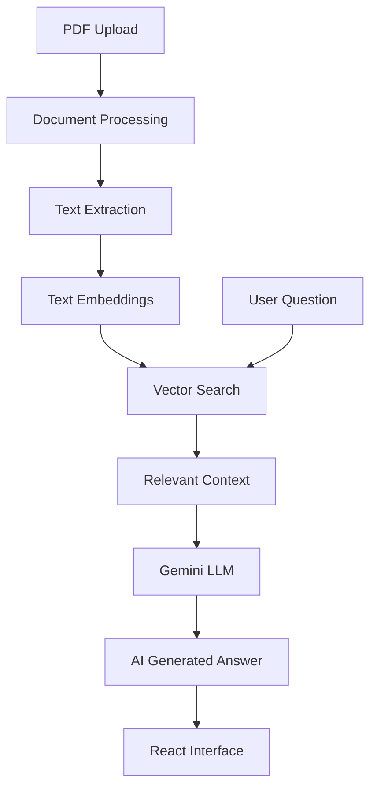

# 📚 AI Study Assistant

> An AI-powered document question-answering application that enables users to upload PDF documents and interact with their content through natural-language questions.

[]()
[]()
[]()
[]()

✨ Overview

AI Study Assistant is a full-stack application that combines document processing, semantic search, vector retrieval, and Generative AI to help users understand information contained within PDF documents.

Instead of relying only on general AI knowledge, the application retrieves relevant document context before generating an answer, enabling more document-focused responses.

🚀 Features

| Feature                 | Description                                            |
| ----------------------- | ------------------------------------------------------ |
| 📄 PDF Upload           | Upload a PDF document for processing                   |
| 🔎 Semantic Search      | Retrieve relevant content based on the user's question |
| 🧠 AI Answers           | Generate context-aware answers using Gemini            |
| 📌 Source Context       | Display relevant document excerpts                     |
| 💬 Natural Language Q&A | Ask questions conversationally                         |
| ⚡ REST API              | React frontend communicates with FastAPI backend       |
| 🎨 Interactive UI       | Simple React-based interface                           |

🏗️ Architecture



🔄 How It Works

1. Upload

The user uploads a PDF document through the React interface.

2. Process

The FastAPI backend extracts and processes the document content.

3. Index

Document content is transformed into embeddings and prepared for semantic retrieval.

4. Retrieve

When a question is submitted, the system identifies relevant document context using vector search.

5. Generate

The retrieved context is provided to Gemini to generate a relevant answer.

6. Display

The response and relevant source content are presented through the React interface.

📁 Project Structure

```text
AI-STUDY-ASSISTANT/
│
├── backend/
│   ├── main.py
│   └── requirements.txt
│
├── frontend/
│   ├── public/
│   └── src/
│       ├── App.js
│       ├── App.css
│       ├── index.js
│       └── index.css
│
├── .gitignore
└── README.md
```

🔌 Backend

The FastAPI backend handles:

* PDF processing
* Document preparation
* Embedding and retrieval workflow
* AI-powered question answering
* Communication between the frontend and AI services

The backend exposes API endpoints for document upload and question answering.

🧠 Key Concepts Demonstrated

 Retrieval-Augmented Generation (RAG)
 Text embeddings
 Vector similarity search
 Document processing
 Generative AI integration
 REST API development
 React frontend development
 Frontend–backend integration
 Environment-based configuration

🎯 Project Highlights

 Built an AI-powered document Q&A workflow
 Integrated RAG architecture for document-grounded responses
 Connected a React frontend with a FastAPI backend
 Implemented PDF processing and semantic retrieval
 Integrated Gemini for context-aware answer generation

